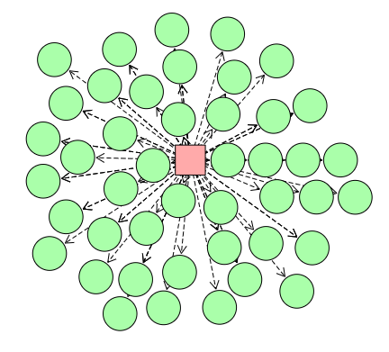

## Network Visualization Tool

A browser-based, interactive network visualization tool inspired by [giotto-mapper-pie-nodes](https://github.com/sperciva/giotto-mapper-pie-nodes)

This tool is flexible and extensible, supporting a variety of different use-cases
 - simple option: plug in your dataset and explore it with default settings
 - expand the visualization in real-time by dynamically retrieving data from a server
 - generate functional standalone html pages that can be used offline
 - customizable graphics and behavior


## Example images (click links for interactive demos)

### gene regulatory network, with default graphics and behavior

[example source code here](simple_example.html)


### gene regulatory network, with custom graphics and behavior

[live interactive demo here](https://grotewold-lab.github.io/network-visualization)

[example source code here](advanced_example.html)


### custom graphics and behavior + server-side processing

[live interactive demo here](https://eglab-dev.com/network)



## Basic Usage

1. Create an html page with a canvas element to contain the visualization

```html
<canvas id="my_canvas" width="800" height="600">
```

2. Reference the file net-vis.js 

```html
<script src="net-vis.js"></script>
```

3. Make another script tag and create some sample data

```js
json_data = {
  nodes:[
    {node_id: "alice"},
    {node_id: "bob"}
  ],
  edges:[
    {
      node_id: "alice",
      target_id: "bob"
    }
  ]
}
```

4. Show static network visualization, using your canvas and json_data

```js
var c = document.getElementById('my_canvas');
var ctx = c.getContext('2d');
show_network_with_static_json(ctx,800,600,json_data)
```

5. Open the html file in your browser to see the static network image


6. Add the mouse listener for interactive features

```js
var c = document.getElementById('my_canvas');
var ctx = c.getContext('2d');
show_network_with_static_json(ctx,800,600,json_data)
add_mouse_listener_to_canvas(c,ctx);
```

7. add an html element to contain the popup that appears when hovering over nodes/edges. See [simple_example.html](simple_example.html) for an example of how to style this element.
```html
<div class="hovermenu"></div>
```

8. Run your html file and click-and-drag to explore the network.


